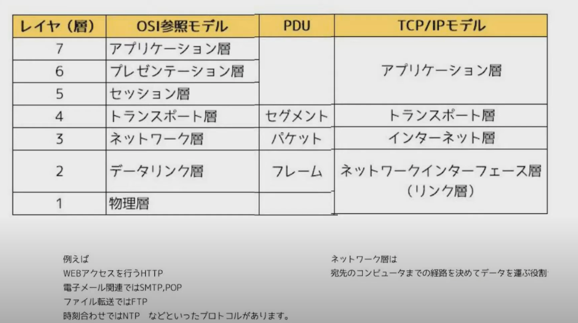
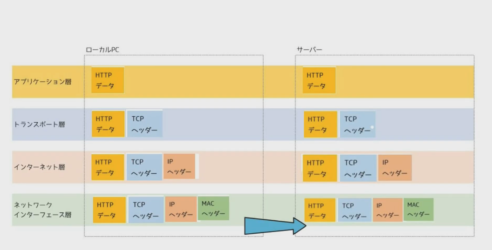

# # 情報処理安全確保支援士試験 (SC) 午前Ⅱ 

- HTTPヘッダ・インジェクション/ OSコマンドインジェクション   
`cat etc/password`などがあったら基本的にパスワード情報を表示させようとしていると考えて良い   
HTTPヘッダ・インジェクションの場合は、%20のような空白などがあることが多い

- SAML   
SAML: 認証、認可などの情報を安全に交換するためのフレームワーク  
SAMLを用いることによって利用者にサービスを提供するサービスプロバイダ(SP)と、IPプロバイダ(Idp)との間で利用者の認証結果などの情報を安全に連携することができる。SAMLには複数の処理方式が存在する。

- ネットワーク  
パソコンやルータ等のネットワーク機器がケーブルなどで接続されて相互に接続して通信できる状態になっているもの   
逆にどこにもつながっておらず単独で存在する状態をスタンドアローンという

  ネットワークを構成するものをノードという、そしてつなぐケーブルをリンク、流れるデータをフローという  

  Local Area Network: LAN 

  Wide Area Network: WAN

  LANからInternetにつなぐにはISPが必要(ISP: Internet Service Provider)

  INTRANET: LAN内のネットワーク（組織内のネットワークのこと） 

  INTERNETとINTRANETは、ファイヤーウォールなどで接続に一定の制限を持たせるのが普通である。

- プロトコル、OSI参照モデル、TCP/IP

  プロトコル: 機器同士が通信を行うために取り決められた約束事のこと

  階層化の標準的なものに、OSI参照モデルがある。
  OSI参照モデルの名前を覚えるゴロ合わせは、「あ!プレゼントね、デブ」   

  あ: アプリケーション層(Application Layer: Layer 7)  
  プ: プレゼンテーション層(Presentation Layer: Layer 6)  
  ゼ: セッション層(Session Layer: Layer 5)   
  ト: トランスポート層(Transport Layer: Layer 4)   
  ね: ネットワーク層(Network Layer: Layer 3)   
  デ: データ層(Data Layer: Layer 2)   
  ブ: 物理層(Physical Layer: Layer 1)   

 

 

 

