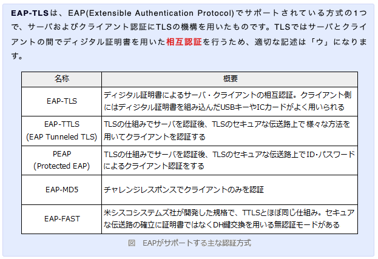

# 情報処理安全確保支援士試験 過去問道場

> 攻撃者が，Webアプリケーションのセッションを乗っ取り，そのセッションを利用してアクセスした場合でも，個人情報の漏えいなどに被害が拡大しないようにするために，重要な情報の表示などをする画面の直前でWebアプリケーションが追加的に行う対策として，最も適切なものはどれか。

答え: パスワードによる利用者認証を行う。

**解説**:   
  セッションハイジャック等によって、ログイン中のセッションが第三者に乗っ取られても、URLやCookieに格納されているセッションIDが正規のものである限り、Webアプリケーション側では「攻撃者によって乗っ取られたリクエスト」なのか「正規ユーザによるリクエスト」なのかの区別がつきません。Webアプリケーション側で、このような不正処理を想定した対策がなされていないと、それを悪用した攻撃者によって正規ユーザの意に反した処理が実行されてしまう恐れがあります。
  特に「ログイン後に決済処理等の重要な処理を行うサイト」などでは、攻撃による被害が大きくなるため、セッション管理の堅牢性を高める必要があります。それに加えてセッションが乗っ取られた場合の不正処理を防ぐために、送金や購入確定、パスワード変更、秘密情報の表示、退会処理などの重要なリクエストをサーバに送信する前には、その利用者が意図したリクエストであるかどうかを識別する仕組みを設ける必要があります。

  重要リクエストの送信直前に行われるパスワード認証には、現在のセッションの相手が正当なユーザであることを確認し、セッションハイジャック等から生じた不正なリクエストを除外する効果があります。

> IEEE802.1Xで使われるEAP-TLSによって実現される認証はどれか。

答え: ディジタル証明書による認証サーバとクライアントの相互認証

**解説**:  

